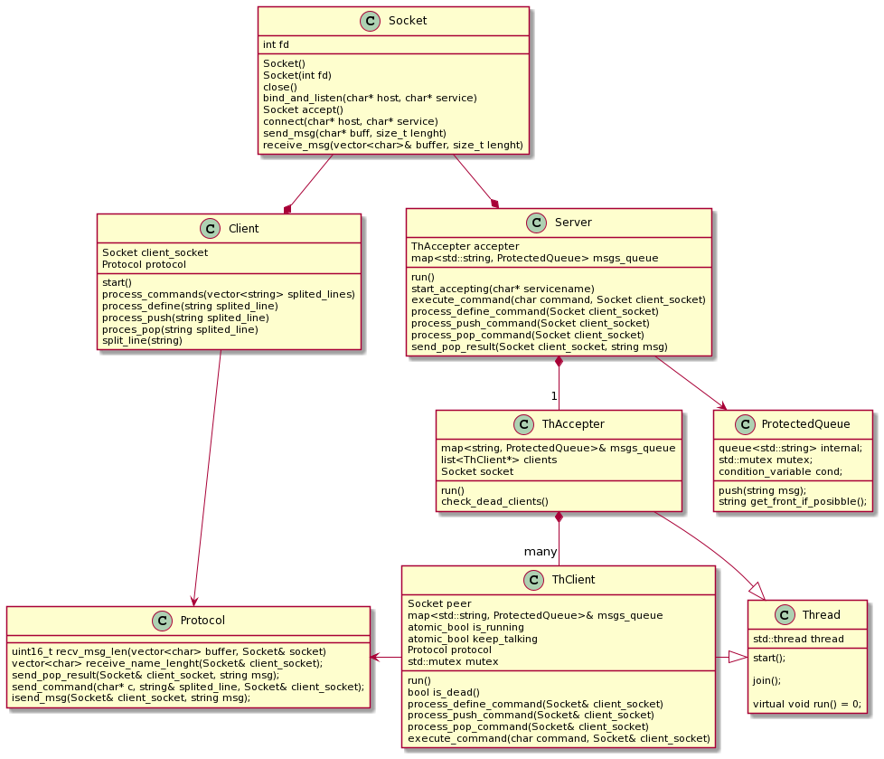

# Trabajo Práctico 3: Middleware

### Taller de programación - 2021 2C - Curso Veiga

### Vázquez Lareu, Román - 100815

### Diseño

Se lanza el servidor, el cual comienza a poder recibir clientes mediante un hilo aceptador minetras que el principal espera por entrada estándar una *q* que indique el cierre del mismo. A su vez, el hilo aceptador lanzará un hilo cliente para atender a cada uno. Al mismo tiempo que acepte clientes, estará corroborando que no haya ningunó muerto (comando *exit* del lado del cliente) y en caso de encontrarlo lo eliminará de la lista de clientes activos. La comunicación entre cliente y servidor se dará según un protocolo. Los clientes ingresarán comandos que serán procesados y enviados al servidor, el cual modificará la estructura almacenada de acuerdo a estos. Unicamente enviará respuesta en caso de que el cliente envíe un comando que implique la lectura de un mensaje.

 

 

### Cierre de servidor

Una vez ingresada por entrada estándar la letra *q* el servidor realizará una serie de acciones que llevarán al cierre del mismo:
1. El hilo aceptador fallará al momento de realizar el *accept()* lanzando una excepción, lo que implicará que salga del *loop* de aceptación de clientes
2. Se llamará su destructor
3. El destructos recorrerá la lista de clientes eliminandolos
4. Se cerrará el socket del servidor (*shutdown()* + *close()*)
5. Se hará *join()* al hilo aceptador
6. Por el lado del cliente, al querér enviar un comando, acusará recibo del *shutdown()* y se desconectará.

### Cliente desconectado

Al ingresar *exit*, el hilo del cliente recibirá un 1 via *recv*, lo que implicará modificar un atributo llamada *is_running* a false. De esta manera cuando el hilo aceptador ejecute la funcion *check_dead_clients()* la respuesta por parte del hilo cliente a `client->!is_dead()` llevará a que el hilo aceptador lo elimine de la lista de clientes y realice un `delete client`

### Zonas críticas Multihilo

Las colas de mensajes de encuentran alojadas en un mapa, los comandos tendrán el siguiente efecto en el mismo (siempre se asume caso óptimo):
1. comando *define nombre_de_cola*: `mapa[nombre_de_cola]`
2. comando *push nombre_de_cola msj*: `mapa[nombre_de_cola].push(msj)`
3. comando *pop nombre_de_cola*: `mapa[nombre_de_cola].pop()`

Previo al acceso al mapa se realiza un `std::lock_guard<std::mutex> lock(mutex)`, a su vez una vez obtenida la cola, la misma es de tipo protegida.
